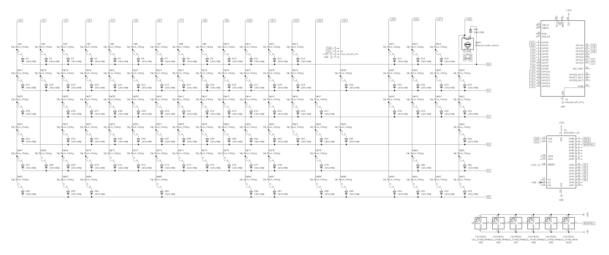
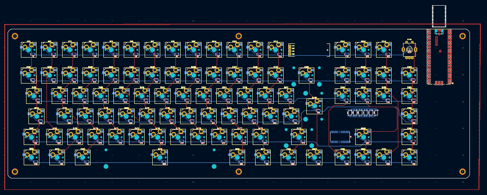
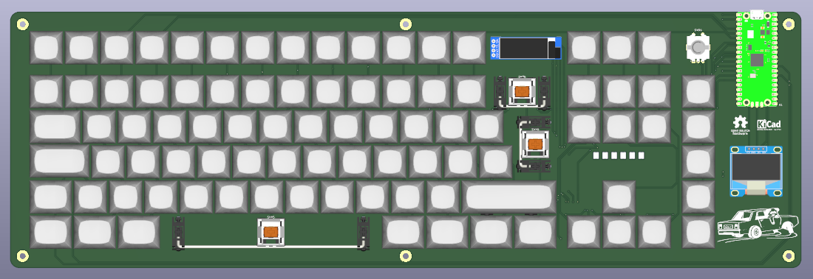
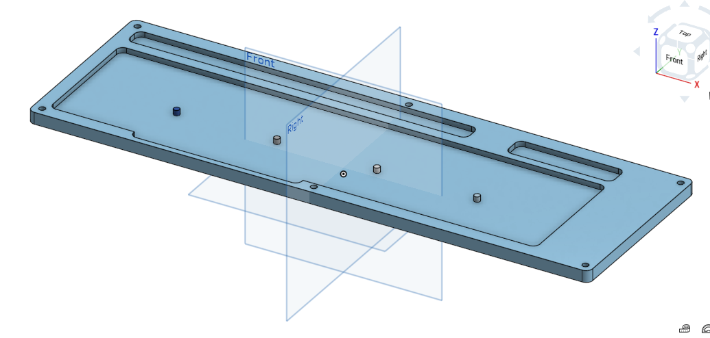
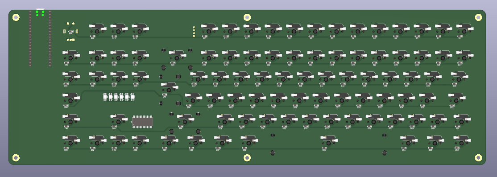
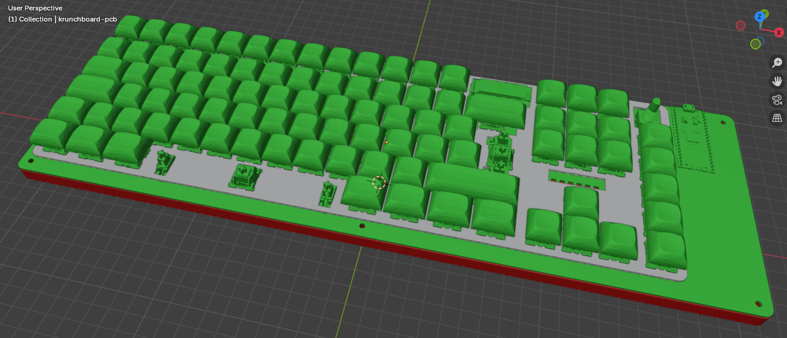

# krunchboard
A 85% (92+1 switches) ISO mechanical keyboard powered by Raspberry Pi Pico

# About
I made this keyboard after I designed my [macropad](https://github.com/RadioactivePotato/krunchpad), and I thought this would be a fun project to do, I've also never owned a mechanical keyboard so maybe this is a good way to start?

# Images

Schematic (click to expand)

| Schematic |
|-----------|
|  |

| PCB | 3D Preview | Case |
|-----|------------|------|
|  |  |  |
| |  | |

# Case

 

# BOM
| Qty | Item                               | Notes                             | Cost (GBP) | URL                                                                                  |
|-----|------------------------------------|-----------------------------------|------------|--------------------------------------------------------------------------------------|
| 1   | Raspberry Pi Pico                  | USB-C Clone                       | 1.92       | [AliExpress](https://www.aliexpress.com/item/1005006067365069.html)                 |
| 93  | 1N4148W Diode (SOD-123)            | Switch matrix                     | 1.69       | [AliExpress](https://www.aliexpress.com/item/1005009063199018.html)                 |
| 1   | EC11 Rotary Encoder                |                                   | 1.89       | [AliExpress](https://www.aliexpress.com/item/1005008413622715.html)                 |
| 1   | Rotary Encoder Knob                |                                   | 0.96       | [AliExpress](https://www.aliexpress.com/item/1005008413622715.html)                 |
| 92  | Kailh MX Hotswap Socket           | Hotswapping for switches          | 7.13       | [AliExpress](https://www.aliexpress.com/item/1005004290562374.html)                 |
| 1   | 0.91" OLED Display                 |                                   | 1.89       | [AliExpress](https://www.aliexpress.com/item/1005008640132638.html)                 |
| 1   | 0.96" OLED Display                 |                                   | 1.99       | [AliExpress](https://www.aliexpress.com/item/1005007772649282.html)                 |
| 1   | MX Stabilisers Set                | For big keycaps                   | 6.38       | [Amazon](https://www.amazon.co.uk/gp/product/B0FGHP1QQN)                            |
| 1   | MCP23017 GPIO Expander (SOIC-28)  | I will buy this myself            | 1.43       | [Digi-Key](https://www.digikey.co.uk/en/products/detail/microchip-technology/MCP23017-E-SO/894271) |
| 2   | 4 Slot 2.54mm Socket              | I will buy this myself            | 0.50       | [Digi-Key](https://www.digikey.co.uk/en/products/detail/adam-tech/RS1-04-G/9829303) |
| 6   | SK6812MINI-E / SK6812E Neopixel   | Already have some                 | 2.17       | [Digi-Key](https://www.digikey.co.uk/en/products/detail/adafruit-industries-llc/4960/14302512) |
|     |                                    |                                   |            |                                                                                      |
| 1   | Keycaps Set                        | Includes -16.73 welcome discount | 18.29      | [AliExpress](https://www.aliexpress.com/item/1005007320960510.html)                 |
| 87  | GATERON Milky Yellow Linear Switch| Main keyboard switches            | 17.79      | [AliExpress](https://www.aliexpress.com/item/1005006425450443.html)                 |
| 5   | Tactile MX-Style Switch           | Macro keys                        | 3.99       | [Amazon](https://www.amazon.co.uk/dp/B0DSJ21RDS)                                    |
| 1   | Keycaps Remover                   | Tools                             | 2.98       | [Amazon](https://www.amazon.co.uk/gp/product/B0CVM8HSFX)                             |
|     |                                    |                                   |            |                                                                                      |
| 6   | M3x5mmx4mm Heatset Inserts (W\*H) | For mounting                      | 2.19       | [Amazon](https://www.amazon.co.uk/dp/B0D1WVNW3G)                                    |
| 6   | M3x4mm Screws                     | For case assembly                 | 3.39       | [Amazon](https://www.amazon.co.uk/dp/B0DRGVKT3R)                                    |
|     |                                    |                                   |            |                                                                                      |
| 1   | Solder Paste                      | Reflow soldering for SMD          | 6.78       | [Amazon](https://www.amazon.co.uk/dp/B0DJX4D5BK)                                    |
| 1   | Solder Wire                       | 50g                               | 3.75       | [AliExpress](https://www.aliexpress.com/item/1005008053204920.html)                 |
|     |                                    |                                   |            |                                                                                      |
| 1   | 3D Printed Case                   | print-legion postage              | 3.35       | print-legion                                                                        |
| 1   | PCB                                | (included coupon, shipping 9.53) | 16.14      | JLCPCB                                                                              |
|     |                                    |                                   |            |                                                                                      |
|     |                                    | **Total AliExpress (GBP)**        | **57.30**  |                                                                                      |
|     |                                    | **Total Amazon (GBP)**            | **25.71**  |                                                                                      |
|     |                                    | **Total AliExpress + Amazon (GBP)**| **83.01**  |                                                                                      |
|     |                                    | **PCB and Case (GBP)**            | **19.49**  |                                                                                      |
|     | **Exclude row 10-12                | Total (GBP)**                     | **102.50** |                                                                                      |
|     | **Exclude row 10-12                | Total (USD)**                     | **138.38** |                                                                                      |

