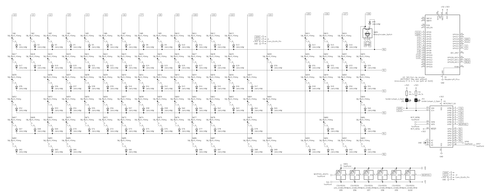
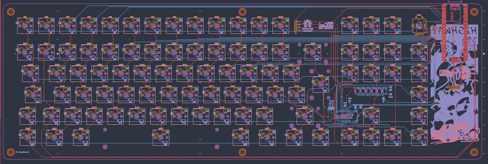
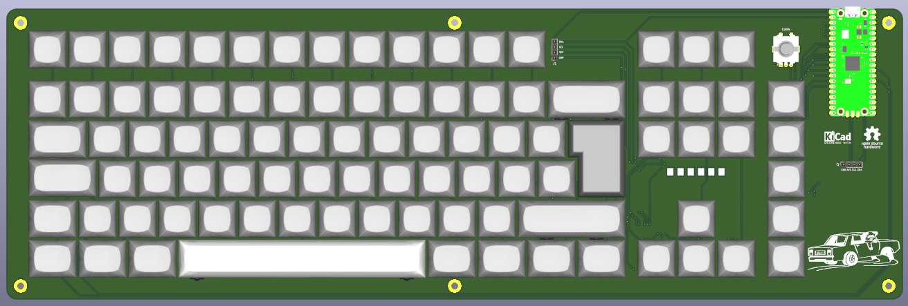
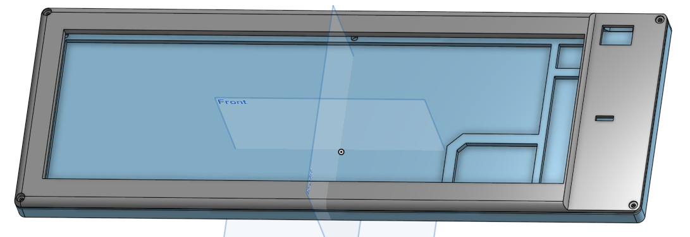
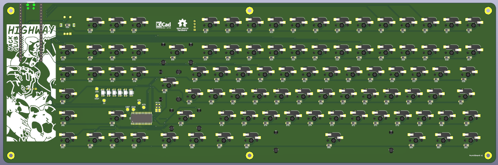
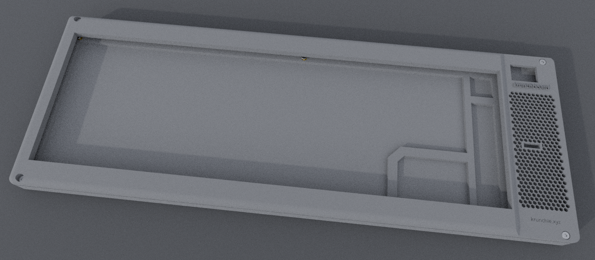
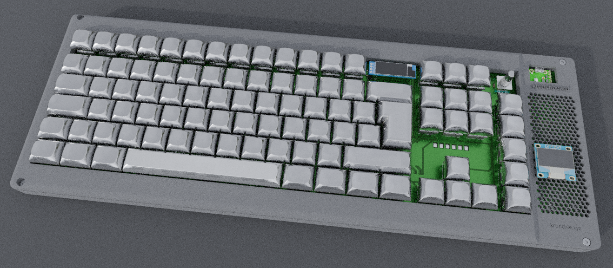

# krunchboard
A 85% (92+1 switches) ISO mechanical keyboard powered by Raspberry Pi Pico

# About
I made this keyboard after I designed my [macropad](https://github.com/RadioactivePotato/krunchpad), and I thought this would be a fun project to do, I've also never owned a mechanical keyboard so maybe this is a good way to start?

# Images

 |

| PCB | 3D View |
|-----|------------|
|  |  |
|  |  |

# Render

# BOM
| Qty | Item                               | Notes                                     | Cost (USD) | URL                                                                                                         |
|-----|------------------------------------|-------------------------------------------|------------|-------------------------------------------------------------------------------------------------------------|
| 1   | Raspberry Pi Pico                  | USB-C Clone                               | 2.44       | [AliExpress](https://www.aliexpress.com/item/1005006067365069.html)                                         |
| 93  | 1N4148W Diode (SOD-123)            | Switch matrix                             | 1.07       | [AliExpress](https://www.aliexpress.com/item/4000558559509.html)                                            |
| 1   | EC11 Rotary Encoder                |                                           | 2.44       | [AliExpress](https://www.aliexpress.com/item/1005008413622715.html)                                         |
| 1   | Rotary Encoder Knob                |                                           | 0.97       | [AliExpress](https://www.aliexpress.com/item/1005007951780072.html)                                         |
| 92  | Kailh MX Hotswap Socket            | Hotswapping for switches                  | 7.46       | [AliExpress](https://www.aliexpress.com/item/1005007476614771.html)                                         |
| 1   | 0.91" OLED Display                 |                                           | 2.12       | [AliExpress](https://www.aliexpress.com/item/1005007672413060.html)                                         |
| 1   | 0.96" OLED Display                 |                                           | 2.18       | [AliExpress](https://www.aliexpress.com/item/1005006985022252.html)                                         |
| 1   | MX Stabilisers Set                 | For big keycaps                           | 8.50       | [Amazon](https://www.amazon.co.uk/gp/product/B0FGHP1QQN)                                                    |
| 1   | MCP23017 GPIO Expander (SOIC-28)   | I will buy this myself                    | 1.62       | [Digi-Key](https://www.digikey.co.uk/en/products/detail/microchip-technology/MCP23017-E-SO/894271)          |
| 2   | 4 Slot 2.54mm Socket (SMD)         | I will buy this myself                    | 3.10       | [Digi-Key](https://www.digikey.co.uk/en/products/detail/samtec-inc/SSM-104-L-SV-BE/7859809)                 |
| 6   | SK6812MINI-E / SK6812E Neopixel    | Already have some                         | 2.95       | [Digi-Key](https://www.digikey.co.uk/en/products/detail/adafruit-industries-llc/4960/14302512)              |
|     |                                    |                                           |            |                                                                                                             |
| 1   | Keycaps Set                        |                                           | 13.44      | [AliExpress](https://www.aliexpress.com/item/1005009177442825.html)                                         |
| 87  | Linear Key Switch                  | Main keyboard switches                    | 9.84       | [AliExpress](https://www.aliexpress.com/item/1005002378701948.html)                                         |
| 5   | Tactile MX-Style Switch            | Shortcut keys switches                    | 5.33       | [Amazon](https://www.amazon.co.uk/dp/B0DSJ21RDS)                                                            |
| 6   | Sticky rubber feet                 | Antislip for keyboard                     | 3.46       | [Amazon](https://www.amazon.co.uk/dp/B0DTGCM631)                                                            |
|     |                                    |                                           |            |                                                                                                             |
| 12  | M3x5mmx4mm Heatset Inserts (W\*H)  | For mounting                              | 2.92       | [Amazon](https://www.amazon.co.uk/dp/B0D1WVNW3G)                                                            |
| 12  | M3x4mm Screws                      | For case assembly                         | 4.53       | [Amazon](https://www.amazon.co.uk/dp/B0DRGVKT3R)                                                            |
|     |                                    |                                           |            |                                                                                                             |
| 1   | Solder Paste                       | Reflow soldering for SMD                  | 10.67      | [Amazon](https://www.amazon.co.uk/dp/B0DJX4D5BK)                                                            |
| 1   | Solder Wire                        | 50g                                       | 3.32       | [AliExpress](https://www.aliexpress.com/item/1005008053204920.html)                                         |
|     |                                    |                                           |            |                                                                                                             |
| 1   | 3D Printed Case                    | print-legion postage (via royal mail)     | 7.00       | print-legion                                                                                                |
| 1   | PCB                                | Shipping $12.89                           | 41.79      | JLCPCB                                                                                                      |
|     |                                    |                                           |            |                                                                                                             |
|     |                                    | **Total AliExpress (GBP)**                | **45.28**  |                                                                                                             |
|     |                                    | **Total Amazon (GBP)**                    | **35.40**  |                                                                                                             |
|     |                                    | **Total AliExpress + Amazon (GBP)**       | **80.68**  |                                                                                                             |
|     |                                    | **PCB and Case (GBP)**                    | **48.79**  |                                                                                                             |
|     |                                    | Total (USD)**                             | **129.47** |                                                                                                             |

